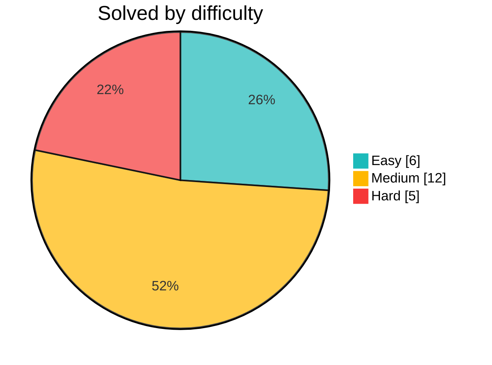

# Algorithms

TypeScript solutions to LeetCode problems, each with Vitest coverage.

## Progress

**23** problems solved

## Problem index

| # | Problem | Difficulty | Code |
| -: | ------- | ---------- | ---- |
| 1 | [Two Sum](https://leetcode.com/problems/two-sum/) |  | [solution](./src/problems/1-two-sum/solution.ts) |
| 2 | [Add Two Numbers](https://leetcode.com/problems/add-two-numbers/) |  | [solution](./src/problems/2-add-two-numbers/solution.ts) |
| 3 | [Longest Substring Without Repeating Characters](https://leetcode.com/problems/longest-substring-without-repeating-characters/) |  | [solution](./src/problems/3-longest-substring-without-repeating-characters/solution.ts) |
| 4 | [Median of Two Sorted Arrays](https://leetcode.com/problems/median-of-two-sorted-arrays/) |  | [solution](./src/problems/4-median-of-two-sorted-arrays/solution.ts) |
| 5 | [Longest Palindromic Substring](https://leetcode.com/problems/longest-palindromic-substring/) |  | [solution](./src/problems/5-longest-palindromic-substring/solution.ts) |
| 6 | [Zigzag Conversion](https://leetcode.com/problems/zigzag-conversion/) |  | [solution](./src/problems/6-zigzag-conversion/solution.ts) |
| 7 | [Reverse Integer](https://leetcode.com/problems/reverse-integer/) |  | [solution](./src/problems/7-reverse-integer/solution.ts) |
| 8 | [String to Integer (atoi)](https://leetcode.com/problems/string-to-integer-atoi/) |  | [solution](./src/problems/8-string-to-integer-atoi/solution.ts) |
| 9 | [Palindrome Number](https://leetcode.com/problems/palindrome-number/) |  | [solution](./src/problems/9-palindrome-number/solution.ts) |
| 149 | [Max Points on a Line](https://leetcode.com/problems/max-points-on-a-line/) |  | [solution](./src/problems/149-max-points-on-a-line/solution.ts) |
| 609 | [Find Duplicate File in System](https://leetcode.com/problems/find-duplicate-file-in-system/) |  | [solution](./src/problems/609-find-duplicate-file-in-system/solution.ts) |
| 861 | [Score After Flipping Matrix](https://leetcode.com/problems/score-after-flipping-matrix/) |  | [solution](./src/problems/861-score-after-flipping-matrix/solution.ts) |
| 978 | [Longest Turbulent Subarray](https://leetcode.com/problems/longest-turbulent-subarray/) |  | [solution](./src/problems/978-longest-turbulent-subarray/solution.ts) |
| 1356 | [Sort Integers by The Number of 1 Bits](https://leetcode.com/problems/sort-integers-by-the-number-of-1-bits/) |  | [solution](./src/problems/1356-sort-integers-by-the-number-of-1-bits/solution.ts) |
| 1499 | [Max Value of Equation](https://leetcode.com/problems/max-value-of-equation/) |  | [solution](./src/problems/1499-max-value-of-equation/solution.ts) |
| 1663 | [Smallest String With A Given Numeric Value](https://leetcode.com/problems/smallest-string-with-a-given-numeric-value/) |  | [solution](./src/problems/1663-smallest-string-with-a-given-numeric-value/solution.ts) |
| 1862 | [Sum of Floored Pairs](https://leetcode.com/problems/sum-of-floored-pairs/) |  | [solution](./src/problems/1862-sum-of-floored-pairs/solution.ts) |
| 1960 | [Maximum Product of the Length of Two Palindromic Substrings](https://leetcode.com/problems/maximum-product-of-the-length-of-two-palindromic-substrings/) |  | [solution](./src/problems/1960-maximum-product-of-the-length-of-two-palindromic-substrings/solution.ts) |
| 2295 | [Replace Elements in an Array](https://leetcode.com/problems/replace-elements-in-an-array/) |  | [solution](./src/problems/2295-replace-elements-in-an-array/solution.ts) |
| 2347 | [Best Poker Hand](https://leetcode.com/problems/best-poker-hand/) |  | [solution](./src/problems/2347-best-poker-hand/solution.ts) |
| 2391 | [Minimum Amount of Time to Collect Garbage](https://leetcode.com/problems/minimum-amount-of-time-to-collect-garbage/) |  | [solution](./src/problems/2391-minimum-amount-of-time-to-collect-garbage/solution.ts) |
| 2574 | [Left and Right Sum Differences](https://leetcode.com/problems/left-and-right-sum-differences/) |  | [solution](./src/problems/2574-left-and-right-sum-differences/solution.ts) |
| 2652 | [Sum Multiples](https://leetcode.com/problems/sum-multiples/) |  | [solution](./src/problems/2652-sum-multiples/solution.ts) |

---

Generated by `npm run readme` · 2026-07-16
